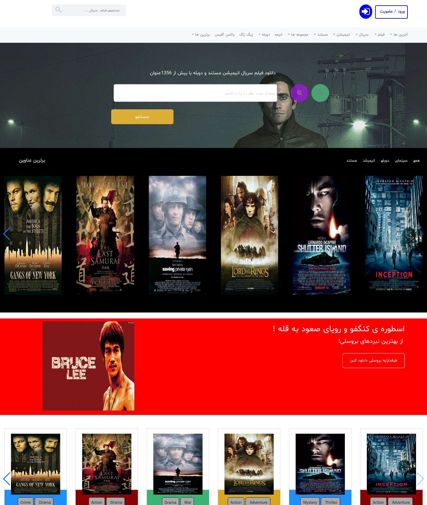
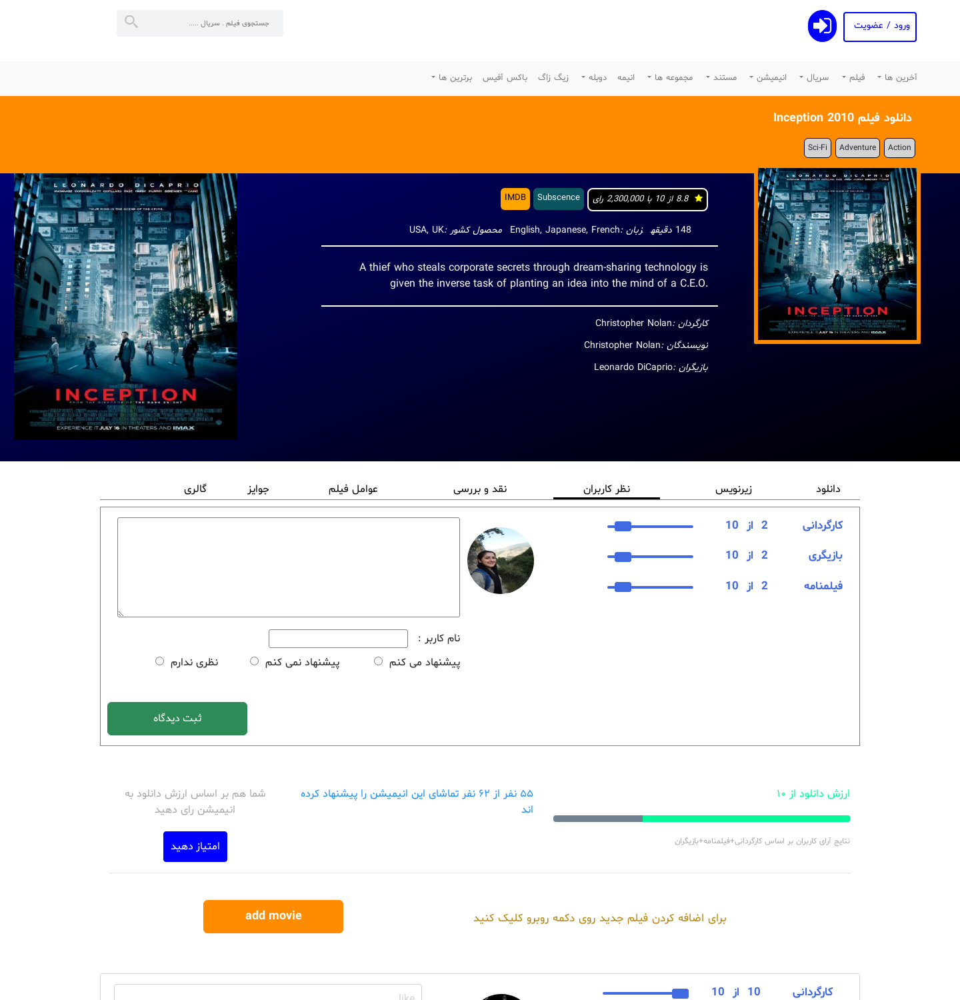

# 🎬 CeitMovie — Persian Movie Catalog

A full-stack, right-to-left (RTL) **Persian movie database**, inspired by sites like IMDb and Iranian film catalogs. Users can browse recently added films, search by title, view rich movie details (cast, plot, ratings, genres), and leave multi-dimensional reviews rating a film's directing, acting, and screenplay separately.

Built as a decoupled single-page application: a **Nuxt.js (Vue)** frontend talking to a lightweight **Hapi.js + MongoDB** REST API.

---

## 📸 Screenshots

### Home
The landing page with a search hero, a "Top Titles" carousel, a featured banner, and a genre-tagged film row.



### Movie details & reviews
Each film has a details page with poster, plot, cast and IMDb-style rating, plus a review panel where visitors rate directing, acting, and screenplay separately.



---

## ✨ Features

- **Home feed** with film carousels/swipers and a featured banner
- **Title search** — case-insensitive, regex-based lookup
- **Movie detail pages** — poster, plot, cast, director, runtime, language, country, and IMDb-style ratings
- **Multi-criteria reviews** — visitors rate directing, acting, and screenplay independently and leave comments
- **Add-a-movie** flow for growing the catalog
- **Full RTL Persian UI** with the Shabnam Farsi font
- **Decoupled architecture** — frontend and API run and deploy independently

---

## 🛠 Tech Stack

| Layer      | Technologies |
|------------|--------------|
| Frontend   | Nuxt.js, Vue 2, Bootstrap-Vue, Vue Awesome Swiper, Axios |
| Backend    | Node.js, Hapi.js, Mongoose |
| Database   | MongoDB |
| Tooling    | ESLint, Babel |

---

## 📂 Project Structure

```
Movie-Website/
├── front/                 # Nuxt.js SPA (frontend)
│   ├── pages/             # Routes: home, movie details, add movie, profile
│   ├── components/        # Header, search, swipers, comments, ratings
│   ├── assets/            # CSS, Shabnam Farsi fonts, images
│   └── plugins/           # Swiper, vue-slider, vue-select
│
├── api/                   # Hapi.js REST API (backend)
│   ├── Server.js          # Server entry point (port 8050)
│   ├── URLs/              # Route handlers: movies, search, comments
│   └── db_schemas/        # Mongoose schemas (movie, comment)
│
└── nuxt.config.js         # Nuxt configuration
```

### API Endpoints

| Method | Route | Description |
|--------|-------|-------------|
| `GET`  | `/movies/recent/{number}` | Most recently added movies |
| `GET`  | `/movies/all`             | All movies |
| `GET`  | `/movies/{id}/details`    | Full details for one movie |
| `POST` | `/submit`                 | Add a new movie |
| `GET`  | `/search/{q}`             | Search movies by title |
| `GET`  | `/movies/{id}/comments`   | Reviews for a movie |
| `POST` | `/movies/{id}/comments`   | Post a review |

---

## 🚀 Getting Started

**Prerequisites:** Node.js and a running MongoDB instance on `localhost:27017`.

### 1. Backend (API)

```bash
cd api
npm install
node Server.js        # runs at http://localhost:8050
```

### 2. Frontend (Nuxt)

```bash
npm install
npm run dev           # runs at http://localhost:3000
```

Other frontend scripts:

```bash
npm run build         # production build
npm start             # start production server
npm run generate      # static site export
npm run lint          # ESLint
```

---

## 📝 Notes

This project was built as an academic/portfolio project to explore full-stack development with Vue/Nuxt and a decoupled Node API. Some detail-page tabs (gallery, awards, critique) are scaffolded as placeholders for future work.

---

## 👤 Author

**Farehe Soheil** — [github.com/FareheSoheil](https://github.com/FareheSoheil/Movie-Website)
